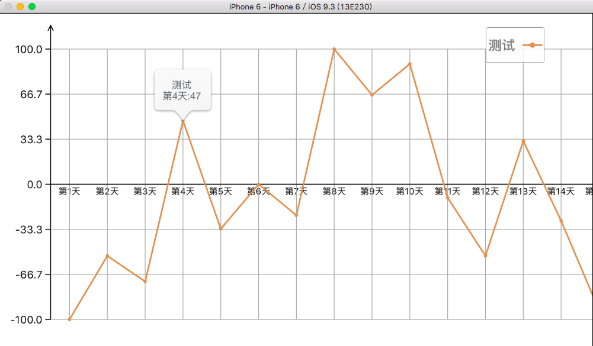

# WZCChartLineView
一款可最大化自定义的折线图与曲线图

	感谢大家对这款曲线/折线图的厚爱, 由于这款折线图目前无法满足实际开发中的效果与用户体验,
	 新的折线图 XCharts 已经出现, XCharts支持实时回放,去除pop数值提示,提供最新的提示方式,
	 同时支持柱状图.
`XCharts` 体验地址: [https://github.com/voisen/XCharts](https://github.com/voisen/XCharts)  
		
老司机们 快快[上车](https://github.com/voisen/XCharts)吧

-----

### 建议使用 [XCharts](https://github.com/voisen/XCharts)

-----

##  特性

* 支持设置 Y 轴刻度数量
* 支持设置 X 轴的位置
* 支持对称显示坐标轴
* 支持设置最小显示的 Y 值 (也支持自动设置 Y 值)
* 支持图例显示
* 支持图例自由拖动
* 点击点支持pop提示类型显示(微信的+号效果显示)
* 支持折线/曲线绘制
* 支持图标区域滚动,Y坐标固定显示
* 支持多条走势线在一个表上显示
* 其他...

## 更新日志

2017.05.27 修复部分bug

2016.10.14 修复添加新功能后的重大 bug, 添加新功能(支持设置 x 轴的位置,支持对称于 X 轴显示坐标, 刻度的数量智能化)

2016.10.13 添加支持设置最小显示的 Y 值 (也支持自动设置 Y 值)

2016.8.12 添加可控参数,控制是否显示辅助线条;增加垂直于 Y 轴的辅助线

## 效果图

* 不要纠结,图例可以任意拖动,坐标轴可以自由设定

* 不要纠结,图例可以任意拖动

* 不要纠结, 图例可以任意拖动, X坐标轴自定义在0点

## WZCChartLineView

~~~~objc

#pragma mark - 必须设置
/** X 坐标轴上的值 (字符串)*/
@property (nonnull,strong,nonatomic) NSArray<NSString*> *x_values;
/* Y坐标上的值 支持多组值 (字符串)*/
@property (nonnull,strong,nonatomic) NSArray<NSArray<NSString*> * > *y_values;
/* 折线的名称/类别 (有几条直线就有一个名字,默认无) */
@property (nonnull,strong,nonatomic) NSArray<NSString*> *y_titles;
/* 折线的颜色数组(默认随机方法) */
@property (nonnull,strong,nonatomic) NSArray<UIColor *> *colorsArray;

/* 以上 设置完毕后才调用绘图方法 */
-(void)startDrawWithLineType:(WZCChartLineType)lineType;

#pragma mark - 可选设置
/**
*  设置最小的 Y 值(默认为0) ,设置时需注意: 如果设置的值大于最大的 Y 值, 则设置为无效;
*
*  @param minValue 最小的 Y 值 (设置负数可以自动设置 Y 值,从最小的 Y 值起步)
*/
- (void)setMinY:(CGFloat)minValue;

/**
*  设置 X 坐标轴的位置
*
*  @param minValue 对应的 Y 值(默认为最小值)
*/
- (void)setXCoordinatesLocationInYValue:(CGFloat)yValue;

/**
*  设置 Y 轴刻度的个数
*
*  @param tipCont 默认为自动
*/
- (void)setCoords_Y_Tips:(NSInteger)tipCont;

/**
*  如果坐标轴中存在负数,调用此函数功能是对称显示坐标
*
*  @param show 是否显示0点刻度
*/
- (void)setCoordPlusAndMinusSymmetryShowZeroPoint:(BOOL)show;

~~~~

## 自定义配置

~~~~objc

#define Arrows_Size 3 //箭头半径
#define Arrows_Height 6 //箭头的高度
#define Coords_lineColor [UIColor blackColor].CGColor //坐标线的颜色
//#define Coords_Y_Tip 5 //刻度个数  -->改动
#define Coords_Y_Tip_Width 6 //刻度宽度
#define Coords_Y_LableFont_Size 12 //Y轴标签的字体大小
#define Coords_X_LableFont_Size 10 //Y轴标签的字体大小
#define Coords_X_Lable_Space 10 //X轴标签间距
#define Coords_X_Verticlal_Line_Color [UIColor lightGrayColor].CGColor //垂直于X轴的线条颜色
#define Coords_X_Verticlal_Line_Width 0.8 //垂直于X轴的线条宽度
#define Coords_Values_Line_Width 1.8 //折线的线条宽度
#define Coords_Legend_Font_Size 15 //图例的字体大小
#define Coords_Y_Verticlal_Line_Color [UIColor lightGrayColor].CGColor //垂直于Y轴的线条颜色
#define Coords_Y_Verticlal_Line_Width 0.8 //垂直于Y轴的线条宽度

//新增---->2016.8.12
#define Show_Coords_X_Verticlal_Line YES // 显示垂直于X轴的线条
#define Show_Coords_Y_Verticlal_Line YES //显示垂直于Y轴的线条

~~~~
 
## 使用

~~~~objc

WZCChartLine *v = [[WZCChartLine alloc]initWithFrame:self.view.bounds];

v.x_values = @[@"一月",@"二月",@"三月",@"四月",@"五月",@"六月",@"七月",@"八月",@"九月",@"十月",@"十一月",@"十二月"];

NSArray *arr1 = @[@"5000",@"5500",@"6200",@"4000",@"3850",@"6489",@"7200",@"5345",@"6740",@"4980",@"4600",@"5390"];
NSArray *arr2 = @[@"500",@"3500",@"610",@"1200",@"3670",@"3320",@"4532",@"1210",@"2100",@"992",@"667",@"873"];
v.y_values = @[arr1,arr2];
v.y_titles = @[@"收入",@"支出"];
v.colorsArray = @[[UIColor greenColor],[UIColor redColor]];

[v startDrawWithLineType:WZCChartLineTypeBroken];

[self.view addSubview:v];

~~~~

