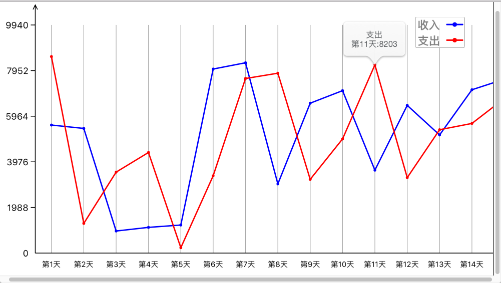
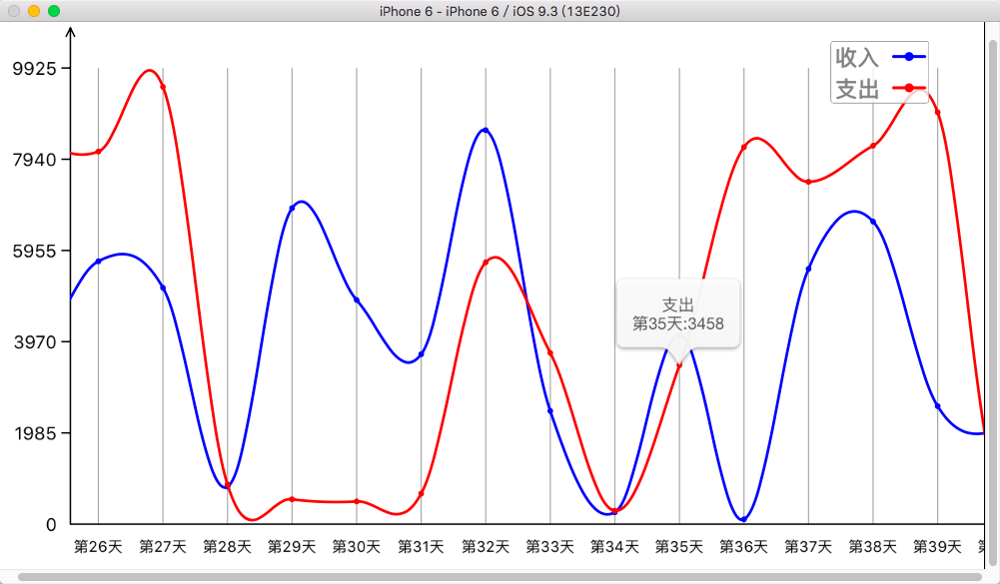

# WZCChartLineView
一款可最大化自定义的折线图与曲线图

##特性
* 支持图例显示
* 支持图例自由拖动
* 点击点支持pop提示类型显示(微信的+号效果显示)
* 支持折线/曲线绘制
* 支持图标区域滚动,Y坐标固定显示
* 支持多条走势线在一个表上显示
* 其他...

##效果图

~~~~objc

/** X 坐标轴上的值 (字符串)*/
@property (nonnull,strong,nonatomic) NSArray<NSString*> *x_values;
/* Y坐标上的值 支持多组值 (字符串)*/
@property (nonnull,strong,nonatomic) NSArray<NSArray<NSString*> * > *y_values;
/* 折线的名称/类别 (有几条直线就有一个名字,默认无) */
@property (nonnull,strong,nonatomic) NSArray<NSString*> *y_titles;
/* 折线的颜色数组(默认随机方法) */
@property (nonnull,strong,nonatomic) NSArray<UIColor *> *colorsArray;

/* 以上 设置完毕后才调用绘图方法 */
-(void)startDrawWithLineType:(WZCChartLineType)lineType;

~~~~

##自定义配置

~~~~objc

#define Arrows_Size 3 //箭头半径
#define Arrows_Height 6 //箭头的高度
#define Coords_lineColor [UIColor blackColor].CGColor //坐标线的颜色
#define Coords_Y_Tip 5 //刻度个数
#define Coords_Y_Tip_Width 6 //刻度宽度
#define Coords_Y_LableFont_Size 12 //Y轴标签的字体大小
#define Coords_X_LableFont_Size 10 //Y轴标签的字体大小
#define Coords_X_Lable_Space 10 //X轴标签间距
#define Coords_X_Verticlal_Line_Color [UIColor lightGrayColor].CGColor //垂直于X轴的线条颜色
#define Coords_X_Verticlal_Line_Width 0.8 //垂直于X轴的线条宽度
#define Coords_Values_Line_Width 1.8 //折线的线条宽度
#define Coords_Legend_Font_Size 15 //图例的字体大小

~~~~

##使用

~~~~objc

WZCChartLine *v = [[WZCChartLine alloc]initWithFrame:self.view.bounds];

v.x_values = @[@"一月",@"二月",@"三月",@"四月",@"五月",@"六月",@"七月",@"八月",@"九月",@"十月",@"十一月",@"十二月"];

NSArray *arr1 = @[@"5000",@"5500",@"6200",@"4000",@"3850",@"6489",@"7200",@"5345",@"6740",@"4980",@"4600",@"5390"];
NSArray *arr2 = @[@"500",@"3500",@"610",@"1200",@"3670",@"3320",@"4532",@"1210",@"2100",@"992",@"667",@"873"];
v.y_values = @[arr1,arr2];
v.y_titles = @[@"收入",@"支出"];
v.colorsArray = @[[UIColor greenColor],[UIColor redColor]];

[v startDrawWithLineType:WZCChartLineTypeBroken];

[self.view addSubview:v];

~~~~